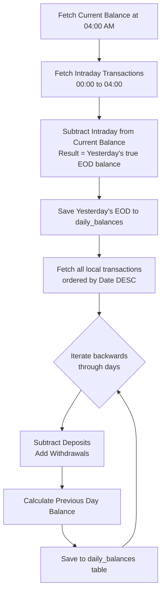

# Ponto API Integration Plan

## Overview
This document outlines the steps required to integrate the Ponto API into `core-finance`, replacing manual CSV uploads with automated bank synchronization. A critical component of this plan is addressing the balance overview, as Ponto only provides the current balance and not a historical time-series of balances.

## 1. Ponto Developer Account Setup
- [ ] Create a developer account on the [Ponto Developer Portal](https://developer.myponto.com/).
- [ ] Register a new application to obtain the `Client ID` and `Client Secret`.
- [ ] Configure the necessary redirect URIs for the application (e.g., `http://localhost:3000/api/integrations/ponto/callback` for development).

## 1b. Hybrid Architecture (Import + API)
- Ensure Ponto synchronization does not replace the existing CSV upload feature, but rather sits alongside it.
- **Handover Strategy:** Since historical data will be imported via CSV for full days, the handover to Ponto is straightforward. The application will find the latest transaction date from the CSV imports for a given account. The Ponto synchronization job will then only import transactions that occur *strictly after* this maximum date, ensuring a clean cut-over without complex transaction-by-transaction deduplication.

## 2. Database Schema Updates
- [ ] Create a new `connected_accounts` table to store Ponto OAuth tokens and account metadata.
  - Columns: `id`, `user_id`, `ponto_account_id`, `access_token`, `refresh_token`, `token_expires_at`, `institution_name`.

## 3. OAuth2 Authorization Flow (Backend & Frontend)
- [ ] **Backend:** Create `backend/routes/integrations.js` with routes for the OAuth flow.
  - `/api/integrations/ponto/auth` - Generates the authorization URL and redirects the user.
  - `/api/integrations/ponto/callback` - Handles the redirect, exchanges the authorization code for tokens, and stores them in `connected_accounts`.
- [ ] **Frontend (Upload View):** Add a "Connect Bank" button in the Upload view alongside the manual CSV import to trigger the OAuth flow.
- [ ] **Frontend (Settings View):** Update `SettingsView.js` and `backend/routes/settings.js` to include a new "Integrations" or "Ponto" section. This will allow users to:
  - Configure their Ponto `Client ID` and `Client Secret` (saving to the `settings` table).
  - Manage and revoke connected bank accounts.
  - Trigger manual syncs or view sync status.

## 4. Transaction Synchronization
- [ ] **Worker Job:** Create a new background worker task (e.g., in `backend/workerRegistry.js` and `worker/index.js`) to handle Ponto synchronization.
- [ ] **Fetch Logic:** Implement the API calls to Ponto:
  - Call `/accounts` to fetch linked accounts and their `currentBalance`.
  - Call `/accounts/{accountId}/transactions` to fetch recent transactions. Handle pagination if necessary.
- [ ] **Data Mapping:** Map Ponto's JSON response to the `transactions` table schema:
  - `id` -> `external_id` (Crucial for idempotency and preventing duplicates).
  - `valueDate` -> `date`.
  - `amount` -> `amount`.
  - `remittanceInformation` -> `name_description`.
  - `creditorName` / `debtorName` -> `counterparty`.
  - Set `source` to `'ponto'`.
- [ ] **AI Enrichment Pipeline:** After saving new transactions from Ponto to the database, automatically enqueue them for AI processing (categorization, anomaly detection, rule matching) so they receive the same enrichment as CSV imports.
- [ ] **Scheduler & Fetch Logic:**
  - Set up a cron job (e.g., using `node-cron`) to run daily at `04:00 AM`.
  - The worker will determine the last imported date (from CSV or previous Ponto sync).
  - **Strict Full-Day Policy:** The application must *never* fetch transactions for the current, ongoing day. It will only ever request data for complete days (from `00:00:00.000` to `23:59:59.999`). This guarantees that partial-day imports cannot occur, ensuring the integrity of the end-of-day balance reconstruction. If the worker runs on April 7th at 04:00 AM, the maximum bounds it will fetch is April 6th at 23:59:59.999.

## 5. Balance Overview Reconstruction (Algorithm)
Since Ponto only provides a live `currentBalance` (and not a historical end-of-day balance API), historical end-of-day balances must be calculated manually to ensure mathematical perfection.

- [ ] **Calculate Yesterday's True EOD Balance:**
  1. When the sync runs at 04:00 AM, fetch the `currentBalance` from the `/accounts` endpoint.
  2. Fetch any intraday transactions that occurred between `00:00:00.000` today and the current time (`04:00 AM`). **Do not save these to the database** (to respect the Strict Full-Day Policy).
  3. Mathematically reverse these intraday transactions from the `currentBalance` (subtract deposits, add withdrawals).
  4. The resulting number is the exact, true end-of-day balance for `23:59:59` of yesterday. Store this in the `daily_balances` table.
- [ ] **Calculate Historical Balances:** Create a utility function (e.g., `calculateHistoricalBalances`) in the backend:
  1. Take yesterday's true EOD balance.
  2. Fetch all saved transactions for the account ordered by date descending.
  3. Iterate backwards day by day:
     - `Previous Day Balance = Current Day Balance - (Deposits on Current Day) + (Withdrawals on Current Day)`
  4. Update or insert these calculated balances into the `daily_balances` table for historical dates.

### Balance Reconstruction Flow

